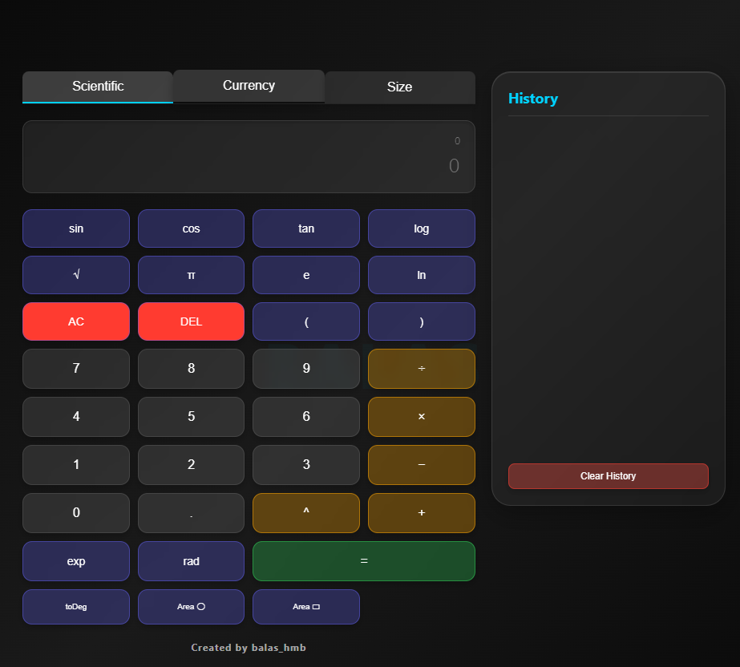

# Scientific Calculator

A versatile, web-based calculator built with HTML, CSS, and JavaScript. This project features multiple modes including a scientific calculator, a currency converter, and a unit size converter for length, area, and volume.

## Live Demo

You can try the live **demo** here: [https://bala-2305.github.io/scientific-calculator/](https://bala-2305.github.io/scientific-calculator/)

## Screenshot

## Features

-   **Scientific Calculator**: Perform advanced mathematical calculations using functions like sine, cosine, tangent, logarithm, square root, and more. It also supports constants like π and e.
-   **Currency Converter**: Easily convert between major currencies like USD, EUR, GBP, INR, and JPY with static exchange rates.
-   **Size Converter**: Convert various units of measurement for length, area, and volume, including both metric and imperial systems.
-   **History Panel**: Keep track of your previous calculations in the scientific mode. You can click on a history item to reload it into the calculator.
-   **Keyboard Support**: Use your keyboard for faster calculations in the scientific mode.
-   **Tabbed Interface**: A clean, tabbed interface to switch between the different calculator modes.

## How to Use

1.  **Switching Modes**: Click on the "Scientific", "Currency", or "Size" tabs at the top to switch between the different calculators.

2.  **Scientific Calculator**:
    *   Use the buttons to input numbers and operations.
    *   The formula is displayed in the top input field, and the result is shown in the bottom display.
    *   `AC` clears the entire input, and `DEL` removes the last character.
    *   The history of your calculations is shown on the right. Click any entry to bring it back to the input field.

3.  **Currency Converter**:
    *   Enter the amount you want to convert.
    *   Select the 'from' and 'to' currencies from the dropdown menus.
    *   Click "Convert" to see the result.

4.  **Size Converter**:
    *   First, select the type of conversion: "Length", "Area", or "Volume".
    *   Enter the value you want to convert.
    *   Choose the 'from' and 'to' units.
    *   Click "Convert" to get the result.

## Keyboard Shortcuts (Scientific Mode)

-   **Numbers (0-9)**, **Operators (+, -, \*, /)**, **Decimal (.)**, **Parentheses (())**: Directly input into the formula.
-   **Enter**: Calculate the result.
-   **Backspace**: Delete the last character.
-   **Escape**: Clear the display.
-   **s**: `sin(`
-   **c**: `cos(`
-   **t**: `tan(`
-   **l**: `log(` (base 10)
-   **n**: `ln(` (natural log)
-   **r**: `sqrt(`
-   **p**: `π`
-   **e**: `e`

## Technologies Used

-   HTML5
-   CSS3
-   JavaScript

## Author

Created by **balas_hmb**
